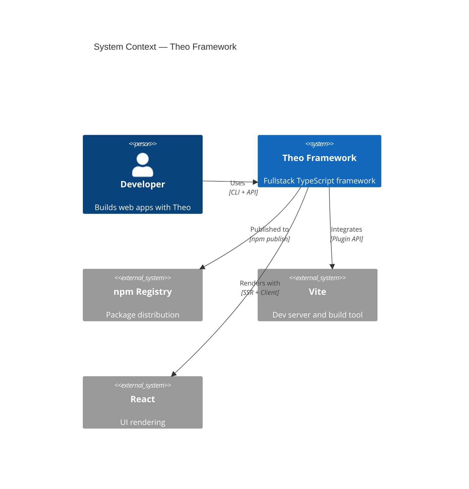
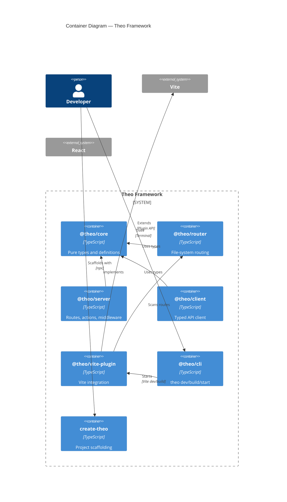
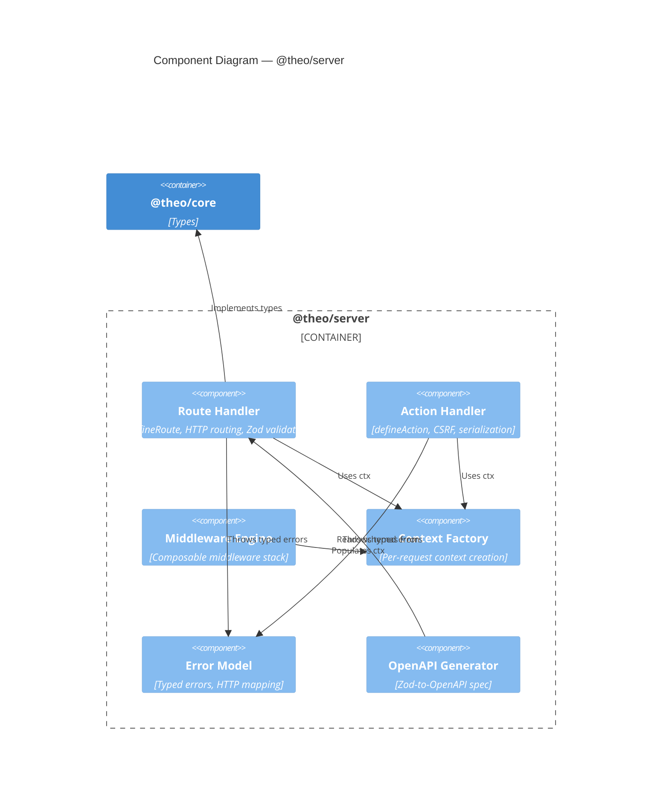

# C4 Model Reference

## C4 Levels Overview

| Level | Shows | Audience | Detail |
|---|---|---|---|
| 1. System Context | System + actors + external systems | Everyone | Highest abstraction |
| 2. Container | Packages/services inside the system | Technical stakeholders | Runtime boundaries |
| 3. Component | Internal structure of a package | Developers | Module level |
| 4. Code (optional) | Class/interface diagrams | Implementers | Lowest abstraction |

## Mermaid C4 Syntax

### System Context (Level 1)



### Container Diagram (Level 2)



### Component Diagram (Level 3)



## Writing Rules

### System Context (Level 1)
- MAX 10 elements
- System is ONE box — no internal detail
- Every arrow has verb + protocol
- Ask: "Who uses this? What does it depend on externally?"

### Container (Level 2)
- Show RUNTIME/PACKAGE boundaries
- A container = npm package or deployable unit
- Technology labels mandatory
- Ask: "What are the packages and how do they relate?"

### Component (Level 3)
- Zoom into ONE package at a time
- Components = modules within the package
- Show only public interfaces
- Ask: "What are the top-level modules and their interactions?"

### Deep Dive Narrative
- Start with the PROBLEM, not the solution
- Follow with constraints
- Then key decisions (link ADRs)
- Then data flow (request lifecycle)
- End with trade-offs and limitations
- Be HONEST about what's missing

## Anti-Patterns

| Anti-Pattern | Do Instead |
|---|---|
| Mixing levels | One diagram per level |
| Speculative elements | Only document what EXISTS |
| Too many elements | Max 10-15 per diagram |
| Missing tech labels | Always label |
| Arrows without verbs | Every Rel has action |
| No narrative | Pair diagrams with prose |

## File Header Template

```markdown
# [Diagram Type] — [System/Package Name]

> Generated: YYYY-MM-DD | Source: [git SHA]
> Scope: [what this covers]
> Audience: [who reads this]

## Overview
[1-3 sentences]

## Diagram
[Mermaid block]

## Key Decisions
- **[Decision]** — [rationale]

## Notes
- [Assumptions, limitations, gaps]
```
