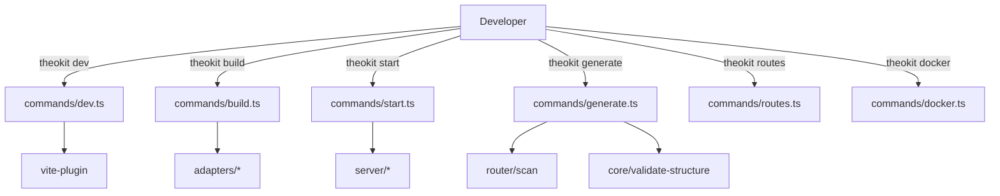

# CLI — System Context

> Baseline snapshot — Phase 0 of cross-domain-uplift-plan. Captures `packages/theo/src/cli/` state **before** Phase 2 (`check`, `add`, `info`).

## Scope

The `cli` domain exposes the `theokit` binary and its subcommands: `dev`, `build`, `start`, `generate`, `routes`, `docker`. Drives all dev-time tooling and dispatches to the right adapter at build time. 7 files, ~726 LOC.

## Entry point

`packages/theo/src/cli/index.ts` — uses `cac` (per `theo` package.json deps) for argv parsing and subcommand registration.

## Commands today

| Command | What it does | Underlying module |
|---|---|---|
| `theokit dev` | Vite dev server with HMR, virtual modules, API middleware | `commands/dev.ts` → `vite-plugin` |
| `theokit build [--target X]` | Dispatches to `adapters/{X}` and runs its `build()` | `commands/build.ts` |
| `theokit start` | Production Node server reading `.theo/client/` | `commands/start.ts` |
| `theokit generate <kind> <name>` | Scaffolds new route/action/middleware/ws file | `commands/generate.ts` |
| `theokit routes` | Lists detected routes from disk (debug helper) | `commands/routes.ts` |
| `theokit docker` | Emits a Dockerfile for the project | `commands/docker.ts` |

## Internal files

```
cli/
├── index.ts                  # cac setup, command registration
└── commands/
    ├── dev.ts                # vite dev orchestration
    ├── build.ts              # adapter dispatcher
    ├── start.ts              # production server (Node-only today)
    ├── generate.ts           # file scaffolding
    ├── routes.ts             # route listing
    └── docker.ts             # Dockerfile generation
```

## Coupling

- `dev`, `build` depend on `vite-plugin`
- `start` depends on `server/*` (lazy imports for production)
- `build` depends on `adapters/*` for target dispatch
- `generate` depends on `core/validate-structure` + `router/scan`
- All commands depend on `config/load-config`

## Strengths

- Each command is < 200 LOC
- `cac` is a mature, tiny argv parser (no over-engineering)
- `dev`/`build`/`start` triad matches user mental model from Next/Astro/Vite

## Limitations (motivating Phase 2)

- **No `check` command.** Today users must run `tsc --noEmit`, `eslint`, and inspect `theokit routes` separately. A consolidated health check is missing.
- **No `add` command.** No discovery for adapters/plugins — users must know npm package names.
- **No `info` command.** Bug reports lack a standard "paste this output" diagnostic.
- **No package manager detection.** When `generate` adds files, it doesn't suggest the right `pnpm add` / `npm install` for missing deps.

## C1 — Context diagram


