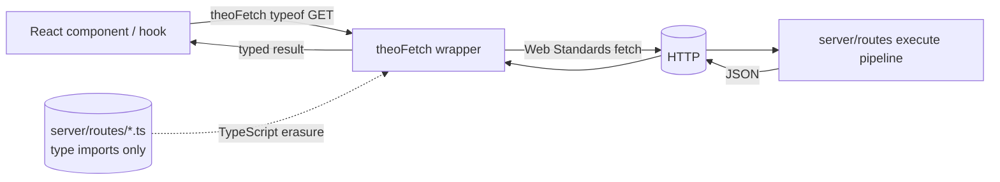

# Client — System Context

> Baseline snapshot — Phase 0 of cross-domain-uplift-plan. Captures `packages/theo/src/client/` state **before** Phase 5 batching/transformer/react-query changes.

## Scope

The `client` domain provides one thing: a typed `fetch` wrapper that consumes server routes by importing their type at compile time. Smallest domain (2 files, ~105 LOC).

## Public surface (`packages/theo/src/client/index.ts`)

- `theoFetch<RouteType>(path, options)` — single function
  - `RouteType` is `typeof GET` (or `typeof POST`, etc.) — the inferred type of `defineRoute(...)` from the server file
  - `options` is `{ query?, body?, params?, fetch?, headers? }` typed from the route's Zod schemas
  - Return type is the inferred response shape

## Innovation vs reference frameworks

| Framework | Mechanism | TheoKit `theoFetch` |
|---|---|---|
| tRPC | Server router object → client codegen / inference | None; client imports route type directly |
| Hono RPC | `hc<App>()` factory typed from app type | None; no app aggregation needed |
| OpenAPI | Codegen pipeline | None; no codegen |

The model is **type-only consumption**: the import is erased at runtime by TypeScript, leaving only a plain `fetch` call. No bundler plugin required, no codegen step.

## Internal files

| File | Role |
|---|---|
| `theo-fetch.ts` | The `theoFetch` function + types |
| `index.ts` | Re-export |

## Request flow today (no batching)

```
component / hook
   ↓
theoFetch<typeof GET>('/api/users', { query: { search } })
   ↓
fetch(buildUrl(path, query), { method, body: JSON.stringify(body), headers })
   ↓
response.json() (raw JSON only — no superjson on client today)
   ↓
typed result
```

## Coupling

- Imports types from user's `server/routes/*` at compile time — no runtime dep on server
- Uses global `fetch` (Web Standards) — no `axios`, no `node-fetch`
- No dependency on TheoKit server modules; client bundle stays small

## Strengths

- 105 LOC, zero runtime dependencies
- Type-only consumption preserves bundle size
- API surface is one function — trivial to learn

## Limitations (motivating Phase 5)

- **No batching.** Each `theoFetch` call is a separate HTTP request, even when fired in the same microtask.
- **No transformer abstraction.** Response is `response.json()` — Date, Set, Map etc. arrive as strings/plain objects on the client.
- **No React Query / SWR integration.** Users wire their own cache layer, write their own `queryKey`s.
- **No subscription mechanism.** WS support is server-side only (`defineWebSocket`); client has no helper.

## C1 — Context diagram


