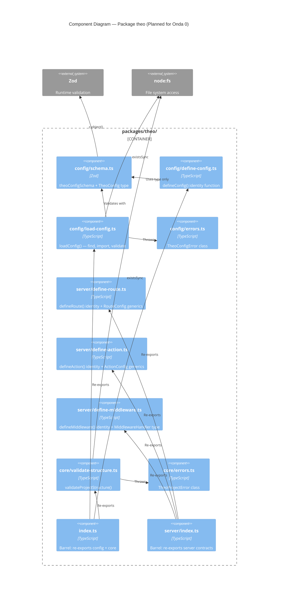

# Component Diagram — Package `theo` (Onda 0 BEFORE)

**Date:** 2026-05-08
**State:** Pre-implementation (greenfield)

## Overview

O pacote `theo` é o coração do framework. Na Onda 0, contém apenas contratos (identity functions) e validação. Nenhum runtime.

## Component Diagram (Planned)



## Components (Planned)

### Config Module (`src/config/`)

| Component | File | Responsibility | Dependencies |
|-----------|------|----------------|--------------|
| Schema | `schema.ts` | Zod schema + TheoConfig type + defaults | `zod` |
| DefineConfig | `define-config.ts` | Identity function for type inference | `schema.ts` (type only) |
| LoadConfig | `load-config.ts` | Find, import, validate config file | `schema.ts`, `errors.ts`, `node:fs` |
| Errors | `errors.ts` | TheoConfigError class | — |

### Server Module (`src/server/`)

| Component | File | Responsibility | Dependencies |
|-----------|------|----------------|--------------|
| DefineRoute | `define-route.ts` | Identity + RouteConfig generics | `zod` (type only) |
| DefineAction | `define-action.ts` | Identity + ActionConfig generics | `zod` (type only) |
| DefineMiddleware | `define-middleware.ts` | Identity + MiddlewareHandler type | Web API globals |

### Core Module (`src/core/`)

| Component | File | Responsibility | Dependencies |
|-----------|------|----------------|--------------|
| ValidateStructure | `validate-structure.ts` | Validate required dirs/files | `errors.ts`, `node:fs` |
| Errors | `errors.ts` | TheoProjectError class | — |

## Data Flow

```
Developer writes theo.config.ts
    → imports defineConfig from 'theo' (type inference)
    → CLI calls loadConfig(dir)
        → finds theo.config.ts
        → dynamic import
        → theoConfigSchema.safeParse()
        → TheoConfig | TheoConfigError

Developer creates project structure
    → CLI calls validateProjectStructure(dir)
        → checks required dirs (app/)
        → checks required files (theo.config.ts, package.json)
        → void | TheoProjectError
```
