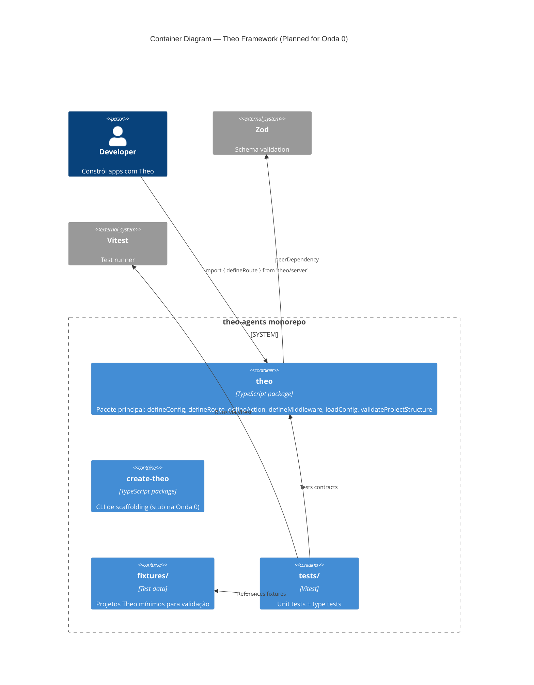

# Container Diagram — Theo Framework (Onda 0 BEFORE)

**Date:** 2026-05-08
**State:** Pre-implementation (greenfield)

## Overview

Nenhum container (package, app, service) existe ainda. Este diagrama mostra a estrutura **planejada** pela Onda 0.

## Container Diagram (Planned)

## Containers (Current State: NONE)

| Container | Exists? | Planned Location | Purpose |
|-----------|---------|------------------|---------|
| `theo` | ❌ | `packages/theo/` | Pacote principal com contratos |
| `create-theo` | ❌ | `packages/create-theo/` | CLI scaffolding (stub) |
| `fixtures/` | ❌ | `fixtures/` | Dados de teste |
| `tests/` | ❌ | `tests/` | Unit + type tests |

## Subpath Exports (Planned)

| Import | Maps to | Content |
|--------|---------|---------|
| `theo` | `packages/theo/src/index.ts` | defineConfig, loadConfig, theoConfigSchema, TheoConfigError, validateProjectStructure, TheoProjectError |
| `theo/server` | `packages/theo/src/server/index.ts` | defineRoute, defineAction, defineMiddleware + types |
