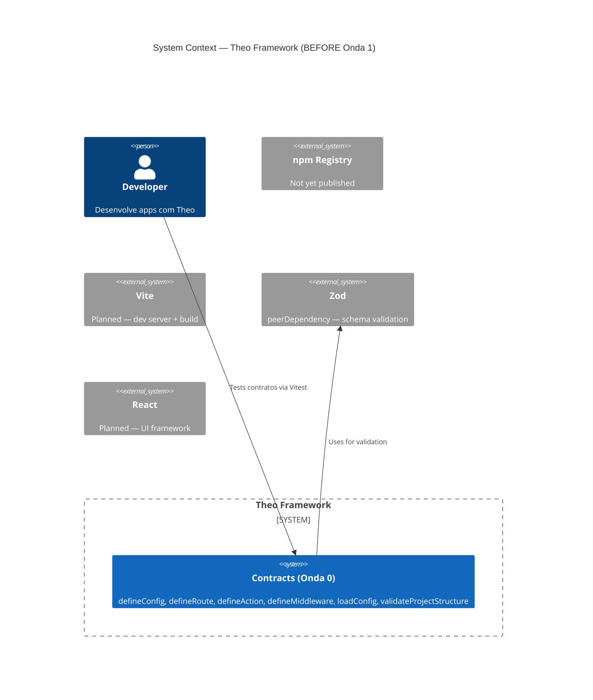

# System Context — Theo Framework (Onda 1 BEFORE)

**Date:** 2026-05-08
**State:** Onda 0 completa — contratos existem, sem CLI/runtime

## Current State

- **Onda 0 completa:** 72 testes passing, 11 type tests, zero TS errors
- **Packages:** `theo` (contratos), `create-theo` (stub vazio)
- **CLI:** ZERO (sem bin entry, sem cac, sem Vite)
- **Dev server:** ZERO
- **Scaffolding:** ZERO (create-theo é stub)
- **Template:** ZERO
