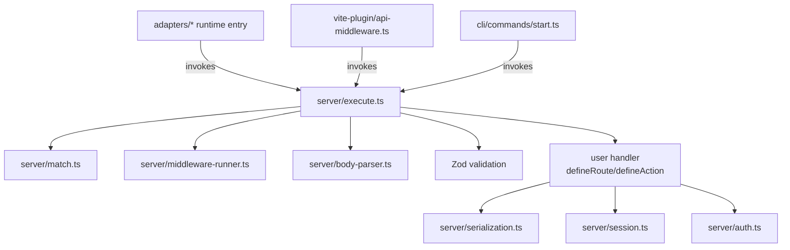

# Server — System Context

> Baseline snapshot — Phase 0 of cross-domain-uplift-plan. Captures `packages/theo/src/server/` state **before** Phase 4 plugin system changes.

## Scope

The `server` domain hosts everything that runs inside the request lifecycle: route matching, body parsing, Zod validation, middleware chain, server actions, WebSocket endpoints, sessions/auth, cookies, rate limiting, logging, serialization, and the request manifest. It is the largest domain (28 files, ~1.6k LOC).

## Public surface (`packages/theo/src/server/index.ts`)

| Export | Role |
|---|---|
| `defineRoute`, `RouteConfig` | Identity function with Zod generics for typed HTTP routes |
| `defineAction`, `ActionConfig` | Server actions with required input schema + CSRF |
| `defineMiddleware`, `MiddlewareHandler` | Request middleware with `await next()` pattern |
| `defineWebSocket`, `WebSocketHandler`, `WebSocketLike` | WS endpoint declaration |
| `defineChannel`, `ChannelHandler`, `ChannelManager` | Pub/sub channels over WS |
| `createSessionManager`, `SessionConfig`, `SessionManager` | AES-256-GCM encrypted cookie sessions |
| `requireAuth`, `AuthRequiredError` | Auth guard with type narrowing |
| `getCookie`, `setCookie`, `deleteCookie`, `CookieOptions` | OWASP-compliant cookie helpers |
| `createRateLimiter`, `RateLimitConfig`, `RateLimitResult` | In-memory rate limiter |
| `parseRequestBody`, `BodyParserOptions`, `UploadedFile`, `ParsedBody` | Body parser (JSON + multipart via busboy) |
| `createLogger`, `logRequest`, `TheoLogger`, `LogLevel`, `StructuredLog`, `RequestLog` | Structured logging |
| `serializeResponse`, `deserializeResponse`, `SerializedResponse` | Rich serialization (superjson today) |
| `generateManifest`, `writeManifest`, `loadManifest`, `TheoManifest`, … | Build-time route manifest |

## Internal modules (not exported)

- `execute.ts` — unified request executor; receives matched route + method + params, runs middleware/context, validates with Zod, calls handler, serializes response, emits structured error responses
- `match.ts` — pattern matcher (`compilePattern`) supporting `[id]`, `[...slug]`
- `scan.ts` — disk scanner for `server/routes/`, produces `ServerRouteNode[]`
- `action-scan.ts`, `action-execute.ts` — equivalents for `server/actions/`
- `ws-scan.ts` — equivalents for `server/ws/`
- `middleware-scan.ts`, `middleware-runner.ts` — composable middleware chain
- `module-loader.ts` — dev (Vite SSR) vs prod (dist) module loader
- `body-parser.ts` — JSON + multipart parsing
- `crypto.ts`, `csrf.ts`, `session.ts`, `cookies.ts` — security primitives
- `serialization.ts` — superjson roundtrip
- `static.ts` — static file serving for `theokit start`
- `suggest.ts` — "Did you mean: /api/health?" 404 hints
- `logger.ts`, `manifest.ts`, `rate-limit.ts`, `channel-manager.ts`

## Request lifecycle (today, before Phase 4)

```
incoming Request
   ↓
match.ts → ServerRouteNode + params
   ↓
execute.ts:
   ├── runMiddlewareAndContext()  (middleware chain + ctx factory)
   ├── parseRequestBody()         (only for POST/PUT/PATCH)
   ├── Zod validation (query/body/params)  → 422 on fail
   ├── handler({ query, body, params, request, ctx })
   ├── serializeResponse() → JSON
   └── sendJson(res, body, status)
   ↓
sendError() in catches — per-call, no central try/catch (this is what T4.1 changes)
```

## Coupling

- `vite-plugin` calls into `server` (`api-middleware.ts`, `action-middleware.ts`) for dev mode
- `adapters` lazy-import `server` modules from emitted runtime entries
- `cli/commands/start.ts` is the Node production server — also lazy-imports `server`

## Strengths

- Zero `any` in production code (per latest dogfood)
- Web Standards-aligned (`Request`/`Response` types where possible)
- AES-256-GCM sessions with OWASP-compliant defaults
- 593 tests covering the domain

## Limitations (motivating Phase 4)

- **No plugin system.** Cross-cutting concerns (auth, tracing, metrics) require either editing every route or `defineMiddleware` per-route — no global hooks.
- **Error handling is per-callsite.** Each module catches and calls `sendError` directly; no central `onError` interception possible.
- **No way to extend `ctx` per-plugin with type safety.** Today `ctx` is shaped by `server/context.ts` factory; plugins can't inject fields.

## C1 — Context diagram


