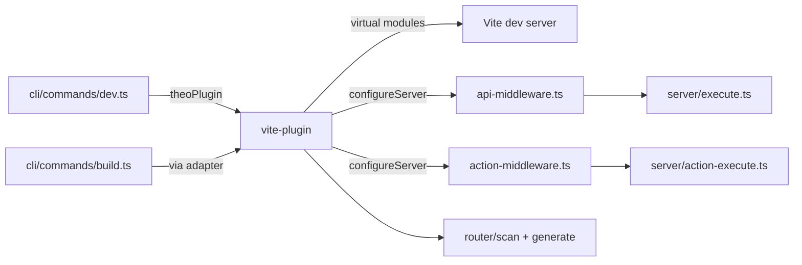

# Vite Plugin — System Context

> Baseline snapshot — Phase 0 of cross-domain-uplift-plan. Captures `packages/theo/src/vite-plugin/` state **before** Phase 3 (`defineTheoIntegration`).

## Scope

The `vite-plugin` domain is the bridge between TheoKit's domain model (routes, actions, WS, manifest) and Vite's build/dev pipeline. 3 files, ~291 LOC.

## Public surface

- `theoPlugin({ root, ssr })` — a function returning a Vite plugin (or array of plugins) that:
  - Registers virtual modules: `/@theo/entry-client`, `/@theo/route-manifest`
  - Injects API middleware into Vite's dev server
  - Injects server-action middleware
  - Configures React via `@vitejs/plugin-react`
  - Optionally produces SSR bundle (when `ssr: true`)

## Internal files

| File | Role |
|---|---|
| `index.ts` | Plugin factory, virtual module resolution, build hooks |
| `api-middleware.ts` | `configureServer` hook that handles `/api/*` requests in dev |
| `action-middleware.ts` | Same for `_action` POST endpoints |

## Virtual modules

```
import '/@theo/entry-client'
  → router.generateEntryClient(tree, config) output

import '/@theo/route-manifest'
  → router.generateRouteManifest(tree) output
```

These are generated on-the-fly by Vite's `resolveId`/`load` hooks. No files on disk.

## Coupling

- Imports `scanRoutes` / `generateEntryClient` / `generateRouteManifest` from `router/`
- Imports `parseRequestBody` / `runMiddlewareAndContext` / etc. from `server/` (for dev-mode request execution)
- Consumed by `cli/commands/dev.ts` and `cli/commands/build.ts`
- Consumed by `adapters/node.ts`, `vercel.ts`, `cloudflare.ts` (for build pipeline)

## Strengths

- Thin shim over Vite — leverages Vite's plugin lifecycle directly
- Virtual modules avoid disk writes during dev
- Dev/prod parity: same `server/*` modules execute requests in both modes

## Limitations (motivating Phase 3)

- **No public extension API.** Third parties cannot register their own hooks into the TheoKit build/dev lifecycle without forking. To add a `/metrics` route, an observability provider must monkeypatch the user's app — there's no `defineTheoIntegration({ hooks: { 'theo:config:setup': ... } })`.
- **Virtual modules namespace is implicit.** `/@theo/*` is reserved by convention, not enforced. EC-6 fixes this for integrations by requiring `virtual:integration:<name>/*` prefix.
- **No way to register additional routes at build time.** A plugin that wants to emit a `/healthz` cannot do so via the current plugin API.

## C1 — Context diagram


